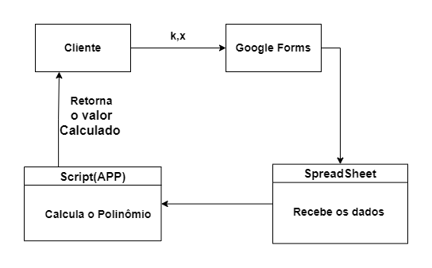

  # sd_ei_1700430_2024
Trabalho de sitemas distribuidos 2024 

Engenharia Informatica 
//link do trabalho a funcionar
//forms
https://forms.gle/eShBmGNVrrevd2R69
//spreedsheat
https://drive.google.com/drive/folders/12BpdiZXThZXZqyv8npe_Y21MBTgLisDP

Nome: António José Cerdeira 
Trabalho: Implementar função polinomio(k,x)

# Descrição do Trabalho
Este projeto pretende desenvolver uma solução que permita aos utilizadores calcular a soma de um polinómio, especificamente 1 + x + x^2 + ... + x^k, através da introdução dos dados num formulário no Google Forms e o cálculo no Google Sheets. A solução será implementada com ajuda Google Apps Script, que permite a criação dos scripts para automatizar tarefas com os serviços do Google Workspace, permitindo aos utilizadores inserir valores e obter o resultado de um cálculo do polinómio. A implementação utiliza os serviços disponíveis na Google Cloud para criar formulários, processar entradas de dados e apresentar os resultados.
#Desenho da arquitetura

Neste sub tópico irmos demonstrar o esquema lógico utilizado 

# Implementação do Trabalho	
  Utilizando uma arquitetura Google Cloud e o Google Apps Script para simular uma interceção entre o cliente e servidor, em que o cliente (Google Forms) insere os dados e apresenta dados e o servidor representado pelo Google Sheets (servidor)processa os dados e envia para o cliente.

Criar formulário no Google Forms.
Criar uma folha do Google Sheets.
Enviar os dados recolhidos para a folha do Google Sheets.
Abrir Google Apps Script.
Criar função que vai Buscar os dados.
Criar função que vai calcular o polinómio.
Criar função que devolve um valor calculado para o Google Form.
Configurar o ‘trigger’ sempre que é introduzido dados novos calcular o polinómio.
Configurar o ‘trigger’ sempre que é editado Google Sheets enviar para Google Forms.
Devolver os valores ao Google Forms.
Apresentar os resultados em HTML.
Fim

# Funcionamento do trabalho	
Criar formulário no Google Forms

Aceder o Google Forms criar um novo formulário, adicionar o k e x para o polinomio. como podemos ver na imaguem a baixo 

Criar uma folha do Google Sheets

Aceder o Google Sheets, criar  uma nova Folha, configurar as colunas de acordo com os dados como são esperados receber do formulário.

Enviar os dados recolhidos para a folha do Google Sheets

No Google Forms, configurardo o formulário, selecionar a opção para enviar os dados para uma folha do Google Sheets escolher o documento criado  anteriormente.

Abrir Google Apps Script

No Google Sheets, vá para "Extensões" e selecione "App Scripts".

Criar funções no Google Apps Script

Onde vamos programar as funções em Google Apps Script para buscar os dados da folha do Google Sheets e os cálculos do polinomio.

Função para recolher dados e devolção valor calculado para a folha de calculo

// Define uma função chamada cal_poli
function cal_poli() {
    // Abre a folha de cálculo pelo ID
    var spreadsheet = SpreadsheetApp.openById('1SavJ3fGS0-MEYsEt9RMwSw1NON9zgtWIdnOxnvxyg9k');
    Logger.log('Folha de cálculo aberta: ' + spreadsheet.getName()); // Regista o nome da folha de cálculo no registo

    // Obtém a folha chamada 'Cal'
    var sheet = spreadsheet.getSheetByName('Cal');

    // Verifica se a folha foi encontrada
    if (!sheet) {
        throw new Error("Página não encontrada."); // Se não encontrada, lança um erro
    }

    // Encontra a última linha com dados na coluna B
    var lastRowB = sheet.getLastRow();
    while (lastRowB > 0 && !sheet.getRange(lastRowB, 2).getValue()) {
        lastRowB--;
    }
    var x = lastRowB > 0 ? sheet.getRange(lastRowB, 2).getValue() : null; // Obtém o valor de x
    Logger.log('Valor de x: ' + x); // Regista o valor de x no registo

    // Encontra a última linha com dados na coluna C
    var lastRowC = sheet.getLastRow();
    while (lastRowC > 0 && !sheet.getRange(lastRowC, 3).getValue()) {
        lastRowC--;
    }
    var k = lastRowC > 0 ? sheet.getRange(lastRowC, 3).getValue() : null; // Obtém o valor de k
    Logger.log('Valor de k: ' + k); // Regista o valor de k no registo

    // Verifica se x ou k são nulos
    if (x === null || k === null) {
        throw new Error("Valores de x ou k não encontrados."); // Se nulos, lança um erro
    }

    // Chama a função polinomio com os valores de k e x e armazena o resultado
    var resultado = polinomio(k, x);
   
    // Obtém a célula onde o resultado será inserido
    var resultRange = sheet.getRange(lastRowB, 4);
    Logger.log('Resultado a ser definido na folha de cálculo: ' + resultado); // Regista o resultado no registo

    // Define o resultado na folha de cálculo
    try {
        resultRange.setValue(resultado);
        Logger.log('Resultado definido na folha de cálculo com sucesso.'); // Se bem-sucedido, regista no registo
    } catch (error) {
        Logger.log('Erro ao definir resultado na folha de cálculo: ' + error); // Se falhar, regista o erro no registo
    }  
}

Função para calcular o polinômio

function polinomio(k, x) {
    let resultado = 0; // Inicializa o resultado do polinómio como 0
    for (let i = 0; i <= k; i++) { // Loop para cada termo do polinómio até o grau k
      resultado += Math.pow(x, i); // Adiciona x elevado a i ao resultado
    }
    return resultado; // Retorna o resultado do polinómio
  }

Configurar triggers

Vamos fazer um trigger para que sempre que recebemos valores na folha de calculo fazer o calculo do polinômio

Configuração do trigger assim que suguir uma respota ao formulario ele dispara 

Apresentar os resultados em HTML

function doGet() {
    // Cria um modelo a partir de um ficheiro HTML chamado 'Index'
    var template = HtmlService.createTemplateFromFile('Index');
 
    // Supondo que a função buscarDados() já esteja definida e retorna os dados necessários
    var data = buscarDados();
 
    // Atribui os dados ao modelo
    template.data = data;
 
    // Avalia o modelo e define o título da página como 'Resultado do Polinómio'
    return template.evaluate().setTitle('Resultado do Polinómio');
  }

function buscarDados() {
    // Obtém a folha de cálculo ativa e procura a aba chamada 'cal'
    var sheet = SpreadsheetApp.getActiveSpreadsheet().getSheetByName('cal');
 
    // Obtém o número da última linha com dados na folha
    var lastRow = sheet.getLastRow();

    // Supondo que a primeira linha seja uma linha de cabeçalho e deseja-se começar a recolher dados a partir da segunda linha
    var firstDataColumn = 2; // Ajuste isso para o número da coluna da primeira célula com dados, se necessário
 
    // Obtém os valores da última linha da folha, a partir da coluna especificada até a última coluna com dados
    var data = sheet.getRange(lastRow, firstDataColumn, 1, sheet.getLastColumn() - firstDataColumn + 1).getValues();
 
    // Retorna os dados como um array unidimensional (um array com os valores da última linha)
    return data[0];
  }

<button class="close-btn" onclick="this.parentElement.style.display='none';">Fechar</button>

<!-- Este é o contêiner para os itens de dados -->

    <label>Primeiro número:</label>
    <!-- Aqui exibimos o primeiro número -->
    <?= data[0]?>

<!-- Este é outro item de dados -->

    <label>Segundo número:</label>
    <!-- Aqui exibimos o segundo número -->
    <?= data[1]?>

<!-- Este é o item de dados para o resultado -->

    <label>Resultado:</label>
    <!-- Aqui exibimos o resultado do cálculo -->
    <?= data[2]?>

# Conclusão
Concluímos com sucesso a implementação de um sistema automatizado que recolhe, calcula e apresenta dados utilizando Google Forms, Google Sheets e Google Apps Script. Inicialmente, criamos um formulário no Google Forms para recolher os dados necessários e configuramos o envio desses dados para uma folha de cálculo no Google Sheets. Em seguida, desenvolvemos funções no Google Apps Script para recolher os dados, calcular o polinômio e devolver os resultados ao Google Forms.
Configuramos os triggers para que as funções sejam acionadas automaticamente sempre que novos dados são introduzidos na folha de cálculo, garantindo a atualização contínua dos resultados no Google Forms. Além disso, desenvolvemos a função que apresenta os resultados em HTML, proporcionando uma visualização mais amigável e interativa dos dados.

Uma melhoria que queríamos implementar era que, assim que o formulário fosse submetido, aparecesse uma janela pop-up com o resultado do cálculo. No entanto, falhamos com o trigger; embora tenhamos conseguido buscar os dados à folha de cálculo, não conseguimos apresentar o resultado de forma automática ao utilizador.
Em suma, o nosso sistema está completamente funcional e pronto para facilitar a recolha e cálculo de polinómios de forma eficiente e automatizada.

# Bibliografia

Google Forms: https://support.google.com/docs/answer/2839737?hl=pt-pt
Google Sheets: https://support.google.com/docs/answer/3540681?hl=pt-pt
Google Apps Script: https://developers.google.com/apps-script/guides/sheets
Triggers no Google Apps Script: https://developers.google.com/apps-script/guides/triggers
HtmlService no Google Apps Script: https://developers.google.com/apps-script/reference/html
